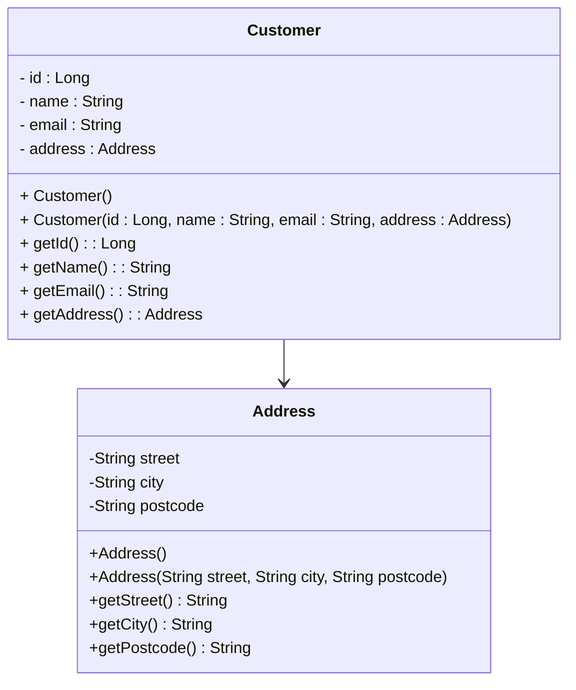

```mermaid
classDiagram
    class Address{
        -String street
        -String city
        -String postcode
        +Address()
        +Address(String street, String city, String postcode)
        +getStreet() String
        +getCity() String
        +getPostcode() String
    }
    
    class Customer{
        - id : Long
        - name : String
        - email : String
        - address : Address
        + Customer()
        + Customer(id : Long, name : String, email : String, address : Address)
        + getId() : Long
        + getName() : String
        + getEmail() : String
        + getAddress() : Address
    }
    Customer --> Address
```