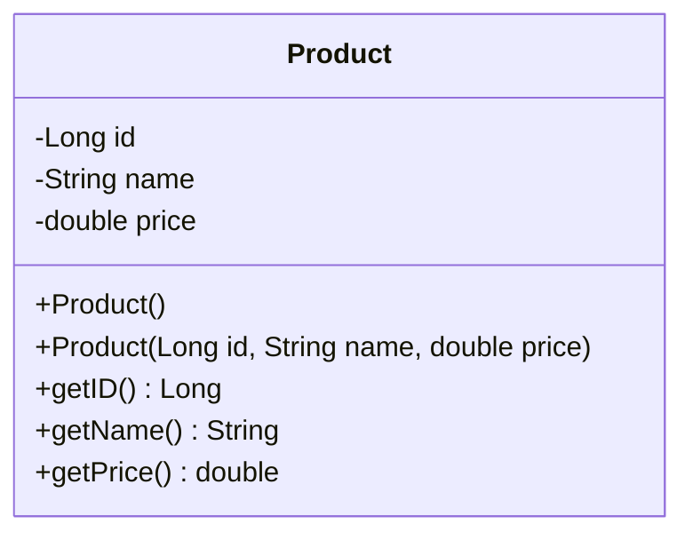

```mermaid
classDiagram
    class Product{
        -Long id
        -String name
        -double price
        +Product()
        +Product(Long id, String name, double price)
        +getID() Long
        +getName() String
        +getPrice() double
    }
```
